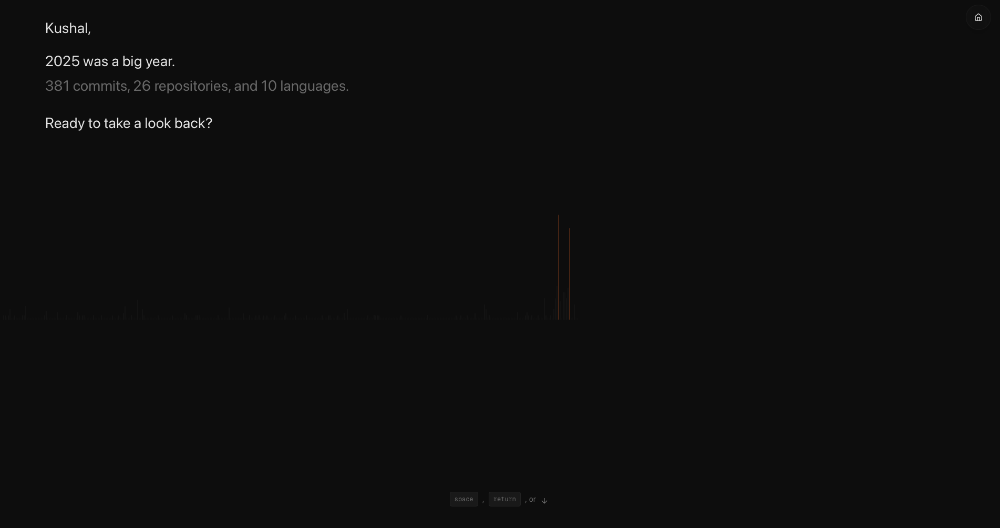
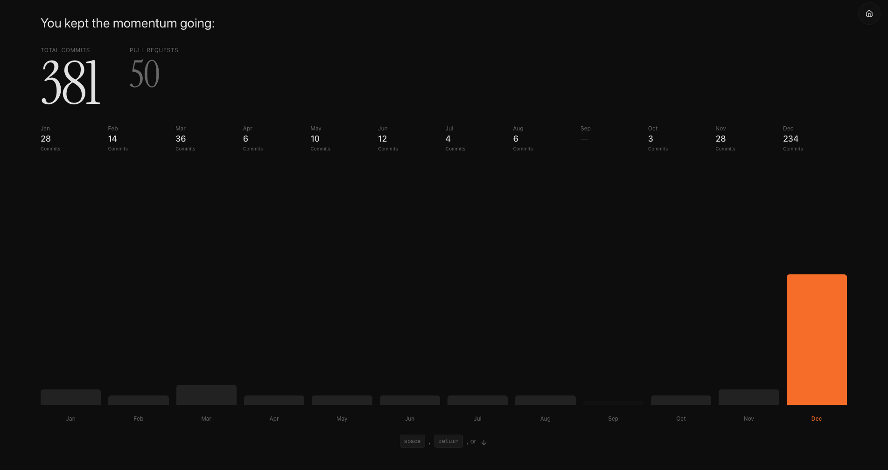
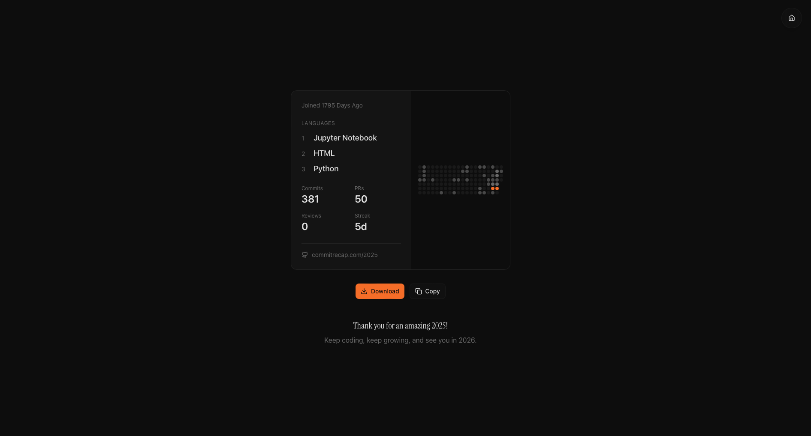

# CommitRecap

CommitRecap turns a GitHub username into a clean year-in-review of commits, pull requests, reviews, languages, and repo focus.
Live site: https://commit-recap.vercel.app

## What you get

- a user summary card with public profile details
- year totals for commits, issues, pull requests, and reviews
- monthly commit counts 
- repo focus and collaboration footprint stats
- contribution heatmap data for charts
- language usage by bytes and by repo stars

## Product Walkthrough






## How it works

- `client/` is a Next.js 16 app using the App Router
- `server/` is a FastAPI API that calls GitHub REST and GraphQL
- API routes are prefixed with `/github/search`
- Endpoint shapes live in `docs/Endpoints.md`

## Local setup

### Prerequisites

- Node.js 18+
- Python 3.11+

### environment variables

Create `.env` in `server/` with these keys:

| key                 | purpose                                         |
| ------------------- | ----------------------------------------------- |
| `GITHUB_TOKEN`    | GitHub personal access token                    |
| `GITHUB_BASE_URL` | GitHub API base URL                             |
| `APP_URL`         | app URL used by the backend                     |
| `LANDING_URL`     | landing page URL used by the backend            |
| `START_DATE`      | default start date for summaries,`YYYY-MM-DD` |
| `END_DATE`        | default end date for summaries,`YYYY-MM-DD`   |

### Run the backend

```bash
cd server
pip install -r requirements.txt
python -m uvicorn main:app --reload
```

### Run the frontend

```bash
cd client
npm install
npm run dev
```


## Repo layout

- `client/src/app/` Next.js routes
- `client/src/components/` shared UI
- `client/src/hooks/` React hooks
- `client/src/lib/` utilities
- `server/api/routers/` FastAPI routers
- `server/api/controllers/` route handlers
- `server/config/` config and env loading
- `assets/` marketing images and logos
- `postman/` Postman collections

## license

MIT. See `LICENSE`.
